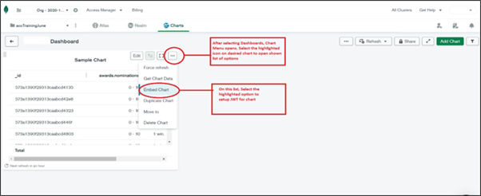
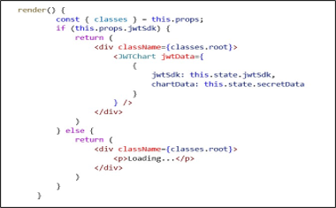

#### Problem Statement:
If any user wants to display MongoDB Charts outside the MongoDB server, there was no authenticated way to achieve it.

#### Solution:
This library resolves the above case by internally authenticating MongoDB Charts using JWT. By using this library, users can display their MongoDB Charts in locally built tools or APIs.

#### Prerequisites to run this library:

To run this library, user needs to have Node.js and React setup within working environment. 

Since it returns a React Component with HTML tags and chart data, its best suggested to use this library with React code for better efficiency 

#### STEPS TO GENERATE JWT IN MONGO CHARTS
Step 1: Login to your teams MongoDB Charts URL. (This URL may be specific for each team)

Once logged in, navigate to ‘Charts’ tab. 


Step 2: After navigation, you will be moved to ‘Dashboards’ page. 

Select any dashboard which will open the chart menu.


Step 3: Select any Chart with three dots in the corner, and choose ‘Embed Chart’ option to setup JWT 

and get Chart URL and Chart ID.



Step 4: Select ‘Authenticated’ option and select ‘Add’ option to add a JWT token of your choice.


Step 5: Enter the details like Name, Provider, Signing Algorithm and Signing Key to add a new JWT token.

#### Below image shows a sample JWT token with HS256 Algorithm.


Step 6: In the same popup window, ‘Chart Id’ and ‘Chart URL’ are present. 

#### Make a note of these values which can be used for library inputs.


#### STEPS TO USE THE LIBRARY​
Step 1: In the same popup window, ‘Chart Id’ and ‘Chart URL’ are present which can be used for library inputs.
After updating file, run command to install this node library. Generally, the command is ‘npm i’ with npm.
```json
"dependencies":{
    "iux-core-node":"^3.5.3",
    "jwt-mongo-chart":"1.0.0",
    "react":"^16.14.0"
}
```
Step 2: To use this library in the project, use below code inside the React javascript file for importing.
```js
import { JWTCart } from 'jwt-mongo-chart';
```
#### Note: The React Component will return a <div> element which contains the rendering chart information.

Step 3: To use this libary with your code, user must provide below 3 inputs

1.Chart ID
2.Chart URL
3.JWT Token

Below are the sample inputs for this.state.secretData
    
    
    
Step 4: The sample code below shows the usage of the library with proper data inputs:
    
       

#### Note: jwtSdk is a boolean. Send true to display chart set this parameter as true, otherwise false.

(This is used to control the timing when the chart can be displayed. If user wants to skip chart rendering in any scenario, they can simply set this field as false)

